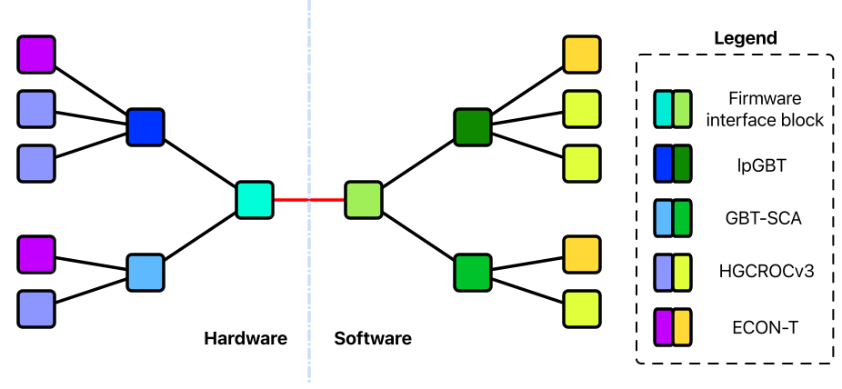

========================
Architecture and Runtime
========================

The SWAMP system is designed to configure a large amount of distributed ICs which are interconnected in a tree like structure. The SWAMP software ensures
that the configuration commands are propelry encapsulated and encoded so that the Hardware delivers the configuration correctly all the way to the intended target.

The SWAMP system includes a runtime to enable users to easily configure a large detector system via a minimal API.
The API abstracts the details of managing a concurrent Hardware with many different encoding levels and IC specific Details, enabling the user to focus on the actual configuration and
detector properties without needing to be a system expert, greatly increasing productivity.
SWAMP uses sophisticated synchronisation thechniques to enable high performance operation for large hardware configuration and is able to run multi threaded.

--------------

Architecture
============
SWAMP is at it's core a collection of composable components that are connected in a way as to mirror (SWAMP = Software Architectural Mirroring Platform) 
the slow control topology of any detector component.
SWAMP components communicate with each other by sending messages. Messages represent atomic actions that are to be performed by the IC corresponding to
the SWAMP-component that generated the message.

   
    An exaple hardware setup being mirrored by the SWAMP software

The SWAMP components are embedded into a multi-thread capable runtime envirounment and wraped by a network accessable API which allows for configuring such a detector or test
system over a network.

There are two types of nodes that make up the SWAMP tree. There are Endpoints and Transports. Messages are generated by endpoints and flow from the endpoints through the transports
to the hardware. Messages flow from *upstream* to *downstream*.

:Endpoints:
  serve to manage the configuration of any IC in the hardware that can be configured. Endpoints accept a human readable configuration
  description in form of a nested map and translate this description into a sequence of messages which is then passed of to a transport node for delivery to the
  corresponding ASIC chip.
:Transports:
  encode/encapsule messages passed to them by the endpoints such that the messages are propely handeled by the hardware IC corresponding to the transport object. Transports
  may be upstream connections to multiple endpoints or transporst and may only have downstream connections to transports. If a transport has multiple downstream
  connections it may use any of them to deliver the messages. If however the stream of messages from a given upstream connection has started using a
  given downstream connection it may not be switched to a different downstream connection.

At the root of the tree sits a special variant of a transport. It delivers messages directly to the hardware and provides a function to check the hardware for responses.
The hardware connection should may be implemented in a custom way for any supported platform. Implementing the interface as a character device unix socket is recommended.
The implementation must provide the transport API described in :ref:`swamp-api`.

Guarantees about SWAMP transactions
-----------------------------------
* The SWAMP software guarantees that the messages coming from a single endpoint will be delivered to the target IC in exactly the order they where issued by that endpoint.
* Each Message sent by an endpoint is acknowledged by the SWAMP system by returning an acknowledgement signal to the endpoint that generated the message. An acknowledgement may signal
  that an error occured or that the hardware has successfully performed the transaction requested by the SWAMP message.  

------------------------

Runtime
=======
The SWAMP runtime consists of at least two threads. The **nt** thread monitors a socket interface for new configuration commands. The **ht** thread monitors the hardware interface for responses generated by the hardware. The nt thread may spawn worker threads to propagate messages back to the endpoints. while continuing to listen for responses from the hardware.

The SWAMP components need to implement the necessary locking logic to ensure proper synchronisation between threads. SWAMP provides classes that handle those synchronisation needs and
provide the ASIC expert with a synchronous programming interface.

Message propagation and load ballancing
---------------------------------------
The messages are propagated towards the hardware interface in stages. This is done to ensure that the transport nodes have all information needed to perform proper load balancing.
A global list of all nodes that need to process incoming information is kept for every tree of the SWAMP. When a configure_ call is placed to the 
